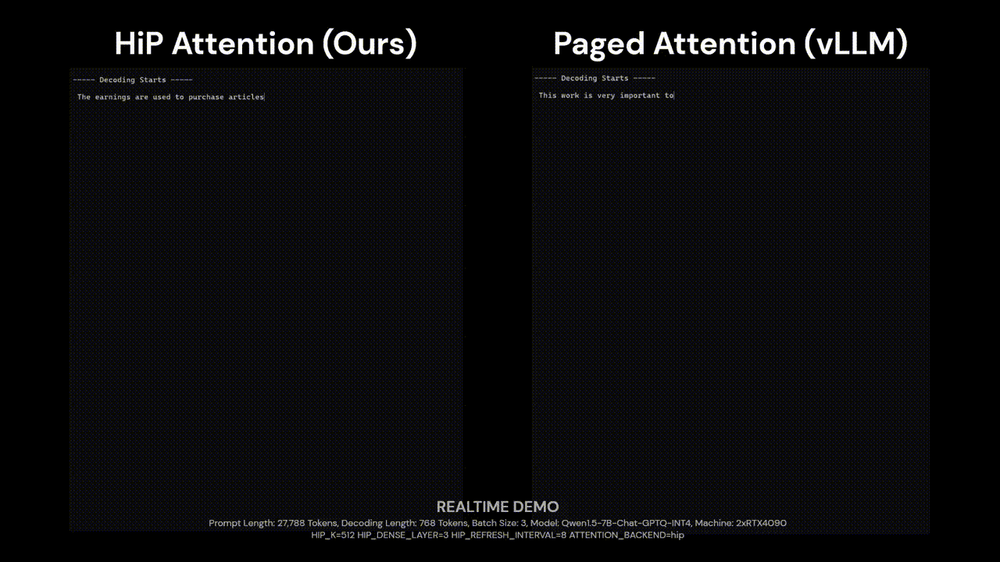

| [**Demo**](docs/demo.mp4) | [**Preprint**](https://arxiv.org/abs/2406.09827) | [**vLLM Integration**](https://github.com/DeepAuto-AI/vllm) | [**SGlang Integration (Preview)**](https://github.com/DeepAuto-AI/sglang) |

**HiP Attention** reduces the computational cost of quadratic attention, such as Flash Attention, into sub-quadratic `O(T log T)` in a plug-and-play manner while maintaining original performance using hierarchically pruned sparse attention. We are aiming to support future researchers while maintaining practical efficiency with this project.

## News

- 2024.09.09: Version 1.1 will be released soon. Please refer to the `ainl-hip-attention2` branch for a preview. It will reduce the latency further and improve the accuracy (and this will fix most of the internal bugs of v1.0). It offers many more experimental options for further research (e.g., key access logs, modular design of masking kernel). As discussed in the Appendix, this release will actually have (hopefully) a KV offloading feature, either UVM or a custom cache management algorithm. Also, SGLang will be supported by this release. Please take a look at our company's fork for a preview.

## Usage

After installation, you can access the `hip` package from any project. `hip` is the code name of HiP attention.

## TL;DR

**We provide an OpenAI-compatible API server built with vLLM and HiP attention!** The only thing you need to integrate HiP is to replace the line of the flash attention call.

```python
- | from flash_attn import flash_attn
- | context = flash_attn_func(q, k, v)
+ | from hip import hip_attention
+ | context, metadata = hip_attention(q, k, v)
```

## API

```py
from torch import Tensor
from typing import Tuple
from hip import hip_attention

# NOTE: you have to scale the Q before pass to our kernel
scale = 1 / (HID ** 0.5)
# NOTE: we support fused RoPE with SelfExtend (https://github.com/datamllab/LongLM)
rope_method: Literal["none", "self_extend"] = "none"
# NOTE: you need to repeat or extend the tensor to match head size.
position_ids: Optional[Tensor] = \
    position_ids.repeat_interleave(self.num_heads, 0) if rope_method != 'none' else None

"""
- q: Tensor[N*H, TDST, HID]
- k: Tensor[N*H, TSRC, HID]
- v: Tensor[N*H, TSRC, HID]
    query, key, value of attention mechanism.
- mask_k: int, 
    same as $k$ in the paper
- block_size_q: int, 
    same as $b_q$ in the paper. 
- block_size_k: int, 
    same as $b_k$ in the paper.
- dense_queries: int, 
    if the $T$ for the given query is shorter than this value, we 
    will use flash attention instead of ours.
- rope_method: Literal['none', 'self_extend'], 
    experimental setting to adopt Self-Extend LM paper. seems not 
    working well, so we did not report this.
- rope_cos, rope_sin, position_ids: Optional[Tensor], 
    please leave them as None unless you want to use Self-Extend LM
- self_extend_scale: int, 
    G1 in Self-Extend
- self_extend_window: int, 
    G2 in Self-Extend
"""

output, _ = hip_attention(
    q=q * scale,
    k=k,
    v=v,
    
    mask_k=512,
    block_size_q=32,
    block_size_k=2,
    
    dense_queries_exp=None if rope_method == 'none' else 0,
    
    rope_method=rope_method,
    rope_cos=rope_cos,
    rope_sin=rope_sin,
    position_ids=position_ids,
    
    self_extend_scale=self.self_extend_scale,
    self_extend_window=self.self_extend_window,
) # type: Tuple[Tensor[N*H, TDST, HID], ...]

from hip import hip_attention, paged_hip_attention

"""
Paged Attention Supported HiP Attention

This function is already integrated with in provided vLLM patches.
Please look following sections, to utilize the paged attention and 
OpenAI compatible API server with HiP.
"""
output, _ = paged_hip_attention(
    ...
) # type: Tuple[Tensor[N*H, TDST, HID], ...]
```

## How To Install

### How to clone the repository

```bash
git clone git@github.com:DeepAuto-AI/hip-attention.git
cd hip-attention
```

### Running Docker

After building the container, run commands below (change `--gpus` and `--tensor-parallel-size` according to your environment):

```bash
docker run --runtime nvidia --rm -it --ipc=host \
    --gpus '"device=0"' \
    -p 8001:8001 \
    -v ~/.cache/huggingface/:/root/.cache/huggingface \
    -e 'ATTENTION_BACKEND=hip' \
    -e 'HIP_K=512' \
    -e 'HIP_REFRESH_INTERVAL=8' \
    -e 'HIP_DENSE_LAYERS=4' \
    deepauto/vllm-hip-openai:latest \
        --port 8001 \
        --model Qwen/Qwen2-1.5B-Instruct \
        --tensor-parallel-size 1 \
        --kv-cache-dtype fp8_e5m2 \
        --dtype half \
        --gpu-memory-utilization 0.50
```

### How to build Docker

Run commands below:

```bash
cd ../
git clone git@github.com:DeepAuto-AI/vllm.git
cd vllm
docker build . --build-context hip=../hip-attention --target vllm-openai --tag deepauto/vllm-hip-openai
```

### Setup without docker

```bash
conda create --name llm python=3.11
conda activate llm

cd hip-attention
pip install -e "."
# Optional for development
pip install -e ".[dev]"

# Optional, depends on your CUDA environment
export CUDACXX=/usr/local/cuda/bin/nvcc
# Dependencies that requires --no-build-isolation
pip install -e ".[no_build_iso]" --no-build-isolation --verbose
# vLLM with OpenAI API support for serving
pip install -e ".[vllm,openai]" --no-build-isolation --verbose
```

### Running without docker
```bash
CUDA_VISIBLE_DEVICES=0 \
VLLM_ATTENTION_BACKEND=HIP_ATTN \
HIP_K=512 \
HIP_REFRESH_INTERVAL=8 \
HIP_DENSE_LAYERS=4 \
python3 -m vllm.entrypoints.openai.api_server \
    --model Qwen/Qwen2-1.5B-Instruct \
    --tensor-parallel-size 1 \
    --kv-cache-dtype fp8_e5m2 \
    --dtype half \
    --gpu-memory-utilization 0.50
```

### vllm + Qwen's Dynamic-NTK

add the following content in Qwen's `config.json`. 

- `seq_length` is the threshold for activating NTK, default 8192 (the same as Qwen).
- `factor` does not affect the logic of dynamic-ntk. It is used by vllm to calculate the maximum input length for model. If it is set to 1, warnings will occur if input is longer than 8192. Setting to 4 may be enough.

```
"rope_scaling": {
    "type": "dynamic-qwen",
    "seq_length": 8192,
    "factor": 4.0
}
```

## Experiments Reproduce

With the following commands, you can reproduce most of our experiments.

### Streaming Demo
```bash
#HiP
CUDA_VISIBLE_DEVICES=0,1 ATTENTION_BACKEND=hip HIP_K=512 HIP_REFRESH_INTERVAL=8 HIP_DENSE_LAYERS=4 python hip/main/model_eval.py --job stream_demo --model vllm_qwen7b --stride 32000 --input samples/32k.md --batch_size 3 --max_tokens 512

#vLLM
CUDA_VISIBLE_DEVICES=0,1 ATTENTION_BACKEND=vllm python hip/main/model_eval.py --job stream_demo --model vllm_qwen7b --stride 32000 --input samples/32k.md --batch_size 3 --max_tokens 512
```
### Generation Demo
```bash
ATTENTION_BACKEND=hip HIP_K=512 HIP_REFRESH_INTERVAL=8 BENCHMARK_RUNNER=1 HIP_DENSE_LAYERS=4 python hip/main/model_eval.py --model vllm_qwen7b --job stream --method hip --k 512 --block_size_q 32 --block_size_k 2 --input samples/32k.md --max_tokens 128 --stride 32000 --batch_size 4
```

### Interactive Generation Demo
```bash
# NOTE: this demo use eager mode. this must be much slower than ideal speed due to single batch and JIT compilation.
python hip/main/model_eval.py --model llama32k --job stream --method hip --k 512 --block_size_q 32 --block_size_k 2
```

### Attention Latency Microbenchmarks
```bash
python hip/models/hip_attention/attention1_block_gpu.py --method hip --k 512 --block_size_q 32 --block_size_k 2 --query_size 32 --dups 16 --batch_size 32 --head_size 40 --hidden_size 128 --samples 200

python hip/models/hip_attention/attention1_block_gpu.py --method none --query_size 32 --dups 16 --batch_size 32 --head_size 40 --hidden_size 128 --samples 200

python hip/models/hip_attention/attention1_block_gpu.py --method flash --query_size 32 --dups 16 --batch_size 32 --head_size 40 --hidden_size 128 --samples 200
```

### Wikitext2 Perplexity
```bash
# HiP
python hip/main/model_eval.py --job ppl --method hip --k 512 --block_size_q 32 --block_size_k 2 --overwrite --model llama32k --stride 8192

# StreamingLLM
python hip/main/model_eval.py --job ppl --method streaming_llm --k 512 --overwrite --model llama32k --stride 8192

# HyperAttention
python hip/main/model_eval.py --job ppl --method hyper_attention --overwrite --model llama32k --stride 8192 --dense_layers 6

# vanilla
python hip/main/model_eval.py --job ppl --method none --k 512 --block_size_q 32 --block_size_k 2 --overwrite --model llama32k --stride 8192
```

### LongBench
```bash
# HiP
HIP_K=512 HIP_DENSE_LAYERS=3 HIP_REFRESH_INTERVAL=8 ATTENTION_BACKEND=hip CUDA_VISIBLE_DEVICES=0 ATTENTION_METHOD=hip python pred.py --method hip --k 512 --model qwen2-7b-chat-32k
python eval.py --method hip --k 512 --modl qwen2-7b-chat-32k

# vLLM
ATTENTION_BACKEND=vllm HIP_K=512 ATTENTION_METHOD=none CUDA_VISIBLE_DEVICES=0 python pred.py --model qwen2-7b-chat-32k --method none --k 512
python eval.py --method none --k 512 --modl qwen2-7b-chat-32k

# StreamingLLM
HIP_K=512 ATTENTION_METHOD=streaming_llm CUDA_VISIBLE_DEVICES=0 python pred.py --model qwen2-7b-chat-32k --method streaming_llm --k 512
python eval.py --method streaming_llm --k 512 --modl qwen2-7b-chat-32k
```

### BookSum
```bash
CUDA_VISIBLE_DEVICES=0 python hip/main/model_eval.py --model llama13b_32k --job booksum --stride 32000 --max_tokens 256 --method streaming_llm --k 512 --name exp_name --overwrite

CUDA_VISIBLE_DEVICES=0 ATTENTION_BACKEND=hip HIP_K=512 HIP_REFRESH_INTERVAL=8 HIP_DENSE_LAYERS=4 python hip/main/model_eval.py --model vllm_llama13b_32k --job booksum --stride 32000 --max_tokens 256 --method hip --k 512 --name exp_name --overwrite

CUDA_VISIBLE_DEVICES=0 ATTENTION_BACKEND=none python hip/main/model_eval.py --model vllm_llama13b_32k --job booksum --stride 32000 --max_tokens 256 --method none --name exp_name --overwrite
```

### UVM Benchmark
```bash
BENCHMARK_RUNNER=1 CACHE_ENGINE='offload_v' ATTENTION_BACKEND='hip' HIP_REFRESH_INTERVAL=8 HIP_DENSE_LAYERS=4 HIP_K=512 CUDA_VISIBLE_DEVICES=0 python hip/main/model_eval.py --model vllm_qwen14b_gptq --job stream --batch_size 4 --input samples/16k.md --stride 22000 --max_tokens 32
```

### Nsight-System
```bash
# with su
MODEL=vllm_luxia21.4b BATCH_SIZE=72 BACKEND=hip HIP_REFRESH_INTERVAL=8 /usr/local/cuda-12.2/bin/nsys profile --gpu-metrics-device all --cuda-graph-trace node --python-backtrace=cuda --gpu-metrics-frequency 10000 --output report_hip_luxia -t cuda -n true  ./scripts/bench_stream_1.sh

MODEL=vllm_luxia21.4b BATCH_SIZE=72 BACKEND=vllm HIP_REFRESH_INTERVAL=1 /usr/local/cuda-12.2/bin/nsys profile --gpu-metrics-device all --cuda-graph-trace node --python-backtrace=cuda --gpu-metrics-frequency 10000 --output report_vllm_luxia -t cuda -n true  ./scripts/bench_stream_1.sh
```

## Development Notes

### Developer Commands (RTX 4090)
```bash
BENCHMARK_RUNNER=1 CACHE_ENGINE='offload_v' ATTENTION_BACKEND='hip' HIP_REFRESH_INTERVAL=8 HIP_DENSE_LAYERS=4 HIP_K=1024 CUDA_VISIBLE_DEVICES=0 python hip/main/model_eval.py --model vllm_qwen14b_gptq --job stream --batch_size 4 --input samples/16k.md --stride 22000 --max_tokens 32

sudo /usr/local/cuda-12.2/bin/ncu --target-processes all -f -o profile ./scripts/bench_stream_1.sh

sudo /usr/local/cuda-12.2/bin/nsys profile -t cuda ./scripts/bench_stream_1.sh

sudo /usr/local/cuda-12.2/bin/nsys profile --gpu-metrics-device all --cuda-graph-trace node --python-backtrace=cuda --gpu-metrics-frequency 50000 --output report_hip_sys_17 -t cuda -n true --env-var FILENAME=16k,PYBIN=`which python`,BACKEND=hip ./scripts/bench_stream_1.sh

lm_eval --model hf --model_args pretrained=togethercomputer/LLaMA-2-7B-32K,load_in_4bit=True,attention_method=streaming_llm,hip_k=512 --tasks arc_easy,arc_challenge,hellaswag,mmlu,truthfulqa,winogrande,gsm8k --device cuda:0 --batch_size 1 --num_fewshot 5

sudo /usr/local/cuda-12.2/bin/nsys profile --gpu-metrics-device all --cuda-graph-trace node --python-backtrace=cuda --gpu-metrics-frequency 50000 --output report_hip_sys_17 -t cuda -n true ./scripts/bench_stream_1.sh

CUDA_VISIBLE_DEVICES=0,1 HIP_K=512 HIP_DENSE_LAYER=4 HIP_REFRESH_INTERVAL=8 ATTENTION_BACKEND=hip python hip/main/model_eval.py --job stream_demo --model vllm_qwen7b --stride 32000 --input samples/32k.md --batch_size 3 --max_tokens 512

CUDA_VISIBLE_DEVICES=0,1 ATTENTION_BACKEND=vllm python hip/main/model_eval.py --job stream_demo --model vllm_qwen7b --stride 32000 --input samples/32k.md --batch_size 3 --max_tokens 512

python examples/openai_chat_image_stress.py --image-file="images/cherry_blossom.jpg" --model="microsoft/Phi-3-vision-128k-instruct" --endpoint="http://localhost:8888/v1" --token="token-blw7qUu6tFQeO9Ch5LVrIBWN3PEx2isaf4Xp" --num-workers 4 --num-seqs 32

MEASURE_PEAK_MEMORY=0 DISABLE_SAMPLING=1 BENCHMARK_RUNNER=1 VLLM_ATTENTION_BACKEND=HIP_ATTN HIP_K=512 HIP_REFRESH_INTERVAL=8 HIP_DENSE_LAYERS=4 CUDA_VISIBLE_DEVICES=0,2 python3 -m vllm.entrypoints.openai.api_server --model microsoft/Phi-3-vision-128k-instruct --download-dir $HF_HOME --tensor-parallel-size 2 --kv-cache-dtype fp8_e5m2 --dtype half --gpu-memory-utilization 0.7 --max-model-len 32000 --max-num-seq 256 --trust-remote-code --image-input-type pixel_values --image-token-id -1 --image-input-shape "1008, 1344" --fake-image-input-shape "1, 16, 3, 336, 336" --image-feature-size 1921 --disable-log-request --max-seq-len-to-capture 32000 --swap-space 4 --port 8888

python examples/openai_chat_image_client.py --image-file="images/cherry_blossom.jpg" --model="microsoft/Phi-3-vision-128k-instruct" --endpoint="http://localhost:8888/v1" --token="token-blw7qUu6tFQeO9Ch5LVrIBWN3PEx2isaf4Xp" --max-tokens 512

VLLM_ATTENTION_BACKEND=HIP_ATTN CUDA_VISIBLE_DEVICES=1 python -c "import vllm; x=vllm.LLM('meta-llama/Meta-Llama-3.1-8B', enforce_eager=True, gpu_memory_utilization=0.7, max_model_len=1024).generate('User: hello, world\nAssistant: '); print(x[0].outputs[0].text)"
```

### Example Training Command
```bash
OMP_NUM_THREADS=16 CUDA_VISIBLE_DEVICES=0,1,2,3 PYTHONPATH=. accelerate launch --num_processes=4 --main_process_port 29501 hip/trainer/hip_trainer_hf.py --method hip --block_size_q 32 --block_size_k 2 --k 512 --lora_r 256 --dataset openwebtext --dense_layers 4 --name bs16_warmup10_dq2k --dense_queries 2048 --seq_len 32768 --disable_kd --sparsity_reg 0.01 --gradient_accumulation_steps 4 --warmup_steps 10 --model giraffe13b --using_deepspeed
```

## Citation

```
@misc{lee2024_hip_attention,
      title={HiP Attention: Sparse Sub-Quadratic Attention with Hierarchical Attention Pruning}, 
      author={Heejun Lee and Geon Park and Youngwan Lee and Jina Kim and Wonyoung Jeong and Myeongjae Jeon and Sung Ju Hwang},
      year={2024},
      eprint={2406.09827},
      archivePrefix={arXiv},
      primaryClass={cs.CL},
      url={https://arxiv.org/abs/2406.09827}, 
}
```
