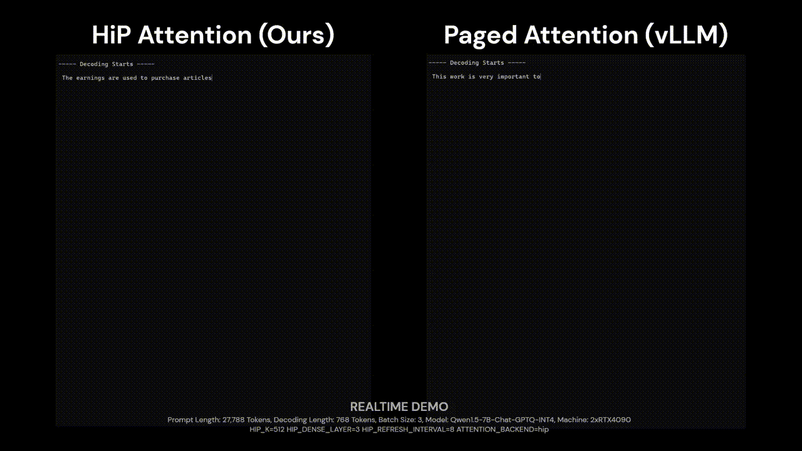

<p float="center">
  
  
</p>

:sunglasses: **HiP Attention** could extend the model context length in a training-free manner and can serve 3 million tokens with a single L40S 48GB GPU while achieving a 7.24 estimated speedup.

| [**Paper (Arxiv, InfiniteHiP *latest*)**](https://arxiv.org/abs/2502.08910) | [**Paper (ICLR 2025)**](https://openreview.net/forum?id=PTcMzQgKmn) | [**SGlang Integration**](https://github.com/DeepAuto-AI/sglang) |

> [!NOTE]
> You can try it in our [Liteai.io LLMOps](https://www.deepauto.ai/litellmops) platform!

> [!IMPORTANT]
> This is **NOT yet free for commercial use**. The license is [FSL-1.1-MIT](https://fsl.software/), which is free for non-commercial use but will automatically convert to MIT license two years after each release. Please refer to the [LICENSE](./LICENSE) for more details.

## News

- 2025.01.26: Version 1.2 is now ready! The preprint is now prepared in [arxiv](https://arxiv.org/abs/2502.08910).
- 2025.01.22: HiP Attention is **accepted in ICLR 2025**!
<details>
<summary>... More News ...</summary>

- 2025.01.03: Version 1.2 will be released soon. The new version fully supports context extension and better controls pruning hierarchy. It will also have better SGlang support (with proper KV offloading!)
- 2024.10.05: Version 1.1 is now ready, check `ainl-hip-offload`. KV offloading feature in under alpha state.
- 2024.09.09: Version 1.1 will be released soon. Please refer to the `ainl-hip-attention2` branch for a preview. It will reduce the latency further and improve the accuracy (and this will fix most of the internal bugs of v1.0). It offers many more experimental options for further research (e.g., key access logs, modular design of masking kernel). As discussed in the Appendix, this release will actually have (hopefully) a KV offloading feature, either UVM or a custom cache management algorithm. Also, SGLang will be supported by this release. Please take a look at our company's fork for a preview.
</details>

## Usage

After installation, you can access the `hip` package from any project. `hip` is the code name of HiP attention.

```py
import torch
from hip import hip_attention_12, HiPAttentionArgs12

device = 'cuda'

batch_size = 1
kv_len = 128 * 1024
q_len = 32 * 1024
num_heads = 32
num_kv_heads = 8
head_dims = 128
dtype = torch.bfloat16

q = torch.randn(
    (batch_size, q_len, num_heads, head_dims),
    dtype=dtype,
    device=device
)
k = torch.randn(
    (batch_size, kv_len, num_kv_heads, head_dims),
    dtype=dtype,
    device=device,
)
v = k.clone()

output, metadata = hip_attention_12(q=q, k=k, v=v, args=HiPAttentionArgs12())
print(output.shape)

# > torch.Size([1, 32768, 32, 128])
```

## Getting Started

### Building from source (Recommanded)

```bash
git clone git@github.com:DeepAuto-AI/hip-attention.git
cd hip-attention

conda create --name hip python=3.11
conda activate hip

pip install -e "."
# Optional for development
pip install -e ".[dev]"

# Optional, depends on your CUDA environment
export CUDACXX=/usr/local/cuda/bin/nvcc
# Dependencies that requires --no-build-isolation
pip install -e ".[no_build_iso]" \
--no-build-isolation \
--verbose
# SGLang with OpenAI API support for serving
pip install -e ".[sglang]" \
--no-build-isolation \
--verbose \
--find-links https://flashinfer.ai/whl/cu124/torch2.4/flashinfer/
```

### Running

See the following pages for more details:

- [Running OpenAI API server examples (SGlang)](docs/USAGE.sglang.md)


### Building Docker

```bash
git clone git@github.com:DeepAuto-AI/hip-attention.git
cd hip-attention
docker build -t hip-sglang:latest -f Dockerfile.sglang .
```

## Experiment Reproduce

Check [how to reproduce experiment](docs/REPRODUCE.md) page

## Citation

```
@misc{lee2024_hip_attention,
      title={A Training-free Sub-quadratic Cost Transformer Model Serving Framework With Hierarchically Pruned Attention},
      author={Heejun Lee and Geon Park and Youngwan Lee and Jaduk Suh and Jina Kim and Wonyoung Jeong and Bumsik Kim and Hyemin Lee and Myeongjae Jeon and Sung Ju Hwang},
      year={2024},
      eprint={2406.09827},
      archivePrefix={arXiv},
      primaryClass={cs.CL},
      url={https://arxiv.org/abs/2406.09827},
}
```
