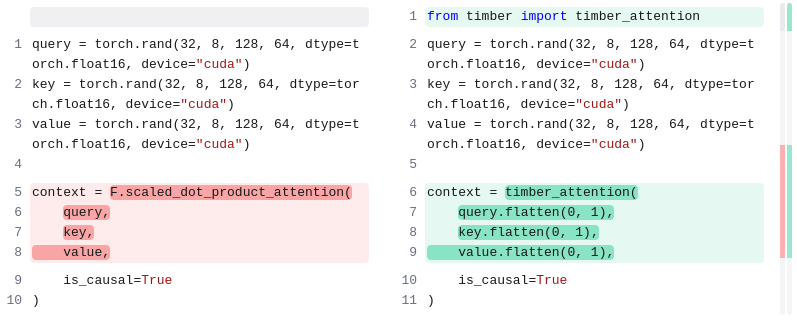

# HiP Attention


# Usage

After installation, you can access to `hip` package from any project. `hip` is code name of HiP attention.

## TL;DR

**We provide OpenAI Compatible API server built with vLLM and HiP attention!**



## API

```py
from torch import Tensor
from typing import Tuple
from hip import (
    hip_attention, 
    HiPAttentionArgs, 
    HiPAttentionOutputMetadata
)

# NOTE: **you have to scale the Q before pass to our kernel**
scale = 1 / (HID ** 0.5)

"""
- q: Tensor[N, TDST, H, HID]
- k: Tensor[N, TSRC, H, HID]
- v: Tensor[N, TSRC, H, HID]
    query, key, value of attention mechanism.

- mask_k: int, 
    same as $k$ in the paper
- block_size_q: int, 
    same as $b_q$ in the paper.
- block_stride_q: int,
    same as $b_{sq}$ in the paper.
- block_size_k: int, 
    same as $b_k$ in the paper.
- block_stride_k: int,
    same as $b_{sk}$ in the paper.

... Please refer HiPAttentionArgs for more details ...
"""

output, _ = hip_attention(
    q=q * scale, # NOTE: **IMPORTANT** You have to scale Q before attention, because we did not implement softmax scaler... 
    k=k,
    v=v,
    mask_k=512,
    block_size_q=64,
    block_stride_q=2,
    block_size_k=2,
    block_stride_k=1,
) # type: Tuple[Tensor[N, TDST, HEAD, HID], HiPAttentionMetadata]

from hip import hip_attention, paged_hip_attention

"""
Paged Attention Supported HiP Attention

This function is already integrated with in provided vLLM patches.
Please look following sections, to utilize the paged attention and 
OpenAI compatible API server with HiP.
"""
output, _ = paged_hip_attention(
    ...
) # type: Tuple[Tensor[N, TDST, H, HID], ...]
```

# How To Install

## How to clone the repository

```bash
git clone {REPO URL}
cd hip-attention
```

## Running Docker

After building the container, run commands below (change `--gpus` and `--tensor-parallel-size` according to your environment):

```bash
docker run --runtime nvidia --rm -it --ipc=host \
    --gpus '"device=0"' \
    -p 8001:8001 \
    -v ~/.cache/huggingface/:/root/.cache/huggingface \
    -e 'ATTENTION_BACKEND=hip' \
    -e 'HIP_K=512' \
    -e 'HIP_REFRESH_INTERVAL=8' \
    -e 'HIP_DENSE_LAYERS=4' \
    hip/vllm-hip-openai:latest \
        --port 8001 \
        --model Qwen/Qwen2-1.5B-Instruct \
        --tensor-parallel-size 1 \
        --kv-cache-dtype fp8_e5m2 \
        --dtype half \
        --gpu-memory-utilization 0.50
```

## How to build Docker

Run commands below:

```bash
cd ../
git clone {REPO URL}
cd vllm
docker build . --build-context hip=../hip-attention --target vllm-openai --tag hip/vllm-hip-openai
```

## Setup without docker

```bash
conda create --name llm python=3.11
conda activate llm

cd hip-attention
pip install -e "."
# Optional for development
pip install -e ".[dev]"

# Optional, depends on your CUDA environment
export CUDACXX=/usr/local/cuda/bin/nvcc
# Dependencies that requires --no-build-isolation
pip install -e ".[no_build_iso]" --no-build-isolation --verbose
# vLLM with OpenAI API support for serving
pip install -e ".[vllm,openai]" --no-build-isolation --verbose
```

## Running without docker
```bash
CUDA_VISIBLE_DEVICES=0 \
VLLM_ATTENTION_BACKEND=HIP_ATTN \
HIP_K=512 \
HIP_REFRESH_INTERVAL=8 \
HIP_DENSE_LAYERS=4 \
python3 -m vllm.entrypoints.openai.api_server \
    --model Qwen/Qwen2-1.5B-Instruct \
    --tensor-parallel-size 1 \
    --kv-cache-dtype fp8_e5m2 \
    --dtype half \
    --gpu-memory-utilization 0.50
```

## vllm + Qwen's Dynamic-NTK

add the following content in Qwen's `config.json`. 

- `seq_length` is the threshold for activating NTK, default 8192 (the same as Qwen).
- `factor` does not affect the logic of dynamic-ntk. It is used by vllm to calculate the maximum input length for model. If it is set to 1, warnings will occur if input is longer than 8192. Setting to 4 may be enough.

```
"rope_scaling": {
    "type": "dynamic-qwen",
    "seq_length": 8192,
    "factor": 4.0
}
```

# Experiments Reproduce

With following commands, you can reproduce most of our experiments.

## Streaming Demo
```bash
#HiP
CUDA_VISIBLE_DEVICES=0,1 VLLM_ATTENTION_BACKEND=HIP_ATTN HIP_K=512 HIP_REFRESH_INTERVAL=8 HIP_DENSE_LAYERS=4 python hip/main/model_eval.py --job stream_demo --model vllm_llama3.1_8b_instruct --stride 32000 --input samples/32k.md --batch_size 3 --max_tokens 512

#vLLM
CUDA_VISIBLE_DEVICES=0,1 VLLM_ATTENTION_BACKEND=FLASH_ATTN python hip/main/model_eval.py --job stream_demo --model vllm_llama3.1_8b_instruct --stride 32000 --input samples/32k.md --batch_size 3 --max_tokens 512
```
## Generation Demo
```bash
VLLM_ATTENTION_BACKEND=HIP_ATTN HIP_K=512 HIP_REFRESH_INTERVAL=8 BENCHMARK_RUNNER=1 HIP_DENSE_LAYERS=4 python hip/main/model_eval.py --model vllm_qwen7b --job stream --method hip --k 512 --block_size_q 32 --block_size_k 2 --input samples/32k.md --max_tokens 128 --stride 32000 --batch_size 4
```

## Interative Generation Demo
```bash
# NOTE: this demo use eager mode. this must be much slower than ideal speed due to single batch and JIT compilation.
python hip/main/model_eval.py --model llama3.1_8b --job stream --method hip --k 512 --block_size_q 32 --block_size_k 2
```

## Attention Latency Microbenchmarks
```bash
python hip/models/hip_attention/attention1_block_gpu.py --method hip --k 512 --block_size_q 32 --block_size_k 2 --query_size 32 --dups 16 --batch_size 32 --head_size 40 --hidden_size 128 --samples 200

python hip/models/hip_attention/attention1_block_gpu.py --method none --query_size 32 --dups 16 --batch_size 32 --head_size 40 --hidden_size 128 --samples 200

python hip/models/hip_attention/attention1_block_gpu.py --method flash --query_size 32 --dups 16 --batch_size 32 --head_size 40 --hidden_size 128 --samples 200
```

## Wikitext2 Perplexity
```bash
# HiP
python hip/main/model_eval.py --job ppl --method hip --k 512 --block_size_q 32 --block_size_k 2 --overwrite --model llama3.1_8b --stride 8192

# StreamingLLM
python hip/main/model_eval.py --job ppl --method streaming_llm --k 512 --overwrite --model llama3.1_8b --stride 8192

# HyperAttention
python hip/main/model_eval.py --job ppl --method hyper_attention --overwrite --model llama3.1_8b --stride 8192 --dense_layers 6

# vanilla
python hip/main/model_eval.py --job ppl --method none --k 512 --block_size_q 32 --block_size_k 2 --overwrite --model llama3.1_8b --stride 8192
```

## LongBench
```bash
# HiP
HIP_K=512 HIP_DENSE_LAYERS=3 HIP_REFRESH_INTERVAL=8 VLLM_ATTENTION_BACKEND=HIP_ATTN CUDA_VISIBLE_DEVICES=0 ATTENTION_METHOD=hip python pred.py --method hip --k 512 --model llama3.1-8b-chat-128k
python eval.py --method hip --k 512 --modl llama3.1-8b-chat-128k

# vLLM
VLLM_ATTENTION_BACKEND=FLASH_ATTN HIP_K=512 ATTENTION_METHOD=none CUDA_VISIBLE_DEVICES=0 python pred.py --model llama3.1-8b-chat-128k --method none --k 512
python eval.py --method none --k 512 --modl llama3.1-8b-chat-128k

# StreamingLLM
HIP_K=512 ATTENTION_METHOD=streaming_llm CUDA_VISIBLE_DEVICES=0 python pred.py --model llama3.1-8b-chat-128k --method streaming_llm --k 512
python eval.py --method streaming_llm --k 512 --modl llama3.1-8b-chat-128k

# use llama3.1-8b-chat-128k for reproduce llama3.1
```

## BookSum
```bash
CUDA_VISIBLE_DEVICES=0 python hip/main/model_eval.py --model llama13b_32k --job booksum --stride 32000 --max_tokens 256 --method streaming_llm --k 512 --name exp_name --overwrite

CUDA_VISIBLE_DEVICES=0 VLLM_ATTENTION_BACKEND=HIP_ATTN HIP_K=512 HIP_REFRESH_INTERVAL=8 HIP_DENSE_LAYERS=4 python hip/main/model_eval.py --model vllm_llama13b_32k --job booksum --stride 32000 --max_tokens 256 --method hip --k 512 --name exp_name --overwrite

CUDA_VISIBLE_DEVICES=0 VLLM_ATTENTION_BACKEND=FLASH_ATTN python hip/main/model_eval.py --model vllm_llama13b_32k --job booksum --stride 32000 --max_tokens 256 --method none --name exp_name --overwrite
```

## UVM Benchmark (no longer supported, you can mimic this kv offload runner)
```bash
BENCHMARK_RUNNER=1 CACHE_ENGINE='offload_v' VLLM_ATTENTION_BACKEND=HIP_ATTN HIP_REFRESH_INTERVAL=8 HIP_DENSE_LAYERS=4 HIP_K=512 CUDA_VISIBLE_DEVICES=0 python hip/main/model_eval.py --model vllm_qwen14b_gptq --job stream --batch_size 4 --input samples/16k.md --stride 22000 --max_tokens 32
```

## KV Offload Runner
```bash
export PYTORCH_CUDA_ALLOC_CONF=expandable_segments:True
export HIP_DISABLE_AUTOTUNE=1 
python hip/models/hip_attention/offload_runner/offload_runner.py --cache_backend uvm --kv_share 1 --method hip --offload-cache --batch_size 1 --sw 256 --k 512 --max_tokens 256 --input ./samples/32k.md --cache_size 4096 --refresh_interval 8 --offload_cache_method single_level
```

## Nsight-System
```bash
# with su
MODEL=vllm_luxia21.4b BATCH_SIZE=72 BACKEND=hip HIP_REFRESH_INTERVAL=8 /usr/local/cuda-12.2/bin/nsys profile --gpu-metrics-device all --cuda-graph-trace node --python-backtrace=cuda --gpu-metrics-frequency 10000 --output report_hip_luxia -t cuda -n true  ./scripts/bench_stream_1.sh

MODEL=vllm_luxia21.4b BATCH_SIZE=72 BACKEND=vllm HIP_REFRESH_INTERVAL=1 /usr/local/cuda-12.2/bin/nsys profile --gpu-metrics-device all --cuda-graph-trace node --python-backtrace=cuda --gpu-metrics-frequency 10000 --output report_vllm_luxia -t cuda -n true  ./scripts/bench_stream_1.sh
```

# Development Notes

## RTX 4090
```bash
BENCHMARK_RUNNER=1 CACHE_ENGINE='offload_v' VLLM_ATTENTION_BACKEND=HIP_ATTN HIP_REFRESH_INTERVAL=8 HIP_DENSE_LAYERS=4 HIP_K=1024 CUDA_VISIBLE_DEVICES=0 python hip/main/model_eval.py --model vllm_qwen14b_gptq --job stream --batch_size 4 --input samples/16k.md --stride 22000 --max_tokens 32

sudo /usr/local/cuda-12.2/bin/ncu --target-processes all -f -o profile ./scripts/bench_stream_1.sh

sudo /usr/local/cuda-12.2/bin/nsys profile -t cuda ./scripts/bench_stream_1.sh

sudo /usr/local/cuda-12.2/bin/nsys profile --gpu-metrics-device all --cuda-graph-trace node --python-backtrace=cuda --gpu-metrics-frequency 50000 --output report_hip_sys_17 -t cuda -n true --env-var FILENAME=16k,PYBIN=`which python`,BACKEND=hip ./scripts/bench_stream_1.sh

lm_eval --model hf --model_args pretrained=togethercomputer/LLaMA-2-7B-32K,load_in_4bit=True,attention_method=streaming_llm,hip_k=512 --tasks arc_easy,arc_challenge,hellaswag,mmlu,truthfulqa,winogrande,gsm8k --device cuda:0 --batch_size 1 --num_fewshot 5

sudo /usr/local/cuda-12.2/bin/nsys profile --gpu-metrics-device all --cuda-graph-trace node --python-backtrace=cuda --gpu-metrics-frequency 50000 --output report_hip_sys_17 -t cuda -n true ./scripts/bench_stream_1.sh

CUDA_VISIBLE_DEVICES=0,1 HIP_K=512 HIP_DENSE_LAYER=4 HIP_REFRESH_INTERVAL=8 VLLM_ATTENTION_BACKEND=HIP_ATTN python hip/main/model_eval.py --job stream_demo --model vllm_qwen7b --stride 32000 --input samples/32k.md --batch_size 3 --max_tokens 512

CUDA_VISIBLE_DEVICES=0,1 VLLM_ATTENTION_BACKEND=HIP_ATTN python hip/main/model_eval.py --job stream_demo --model vllm_qwen7b --stride 32000 --input samples/32k.md --batch_size 3 --max_tokens 512

python examples/openai_chat_image_stress.py --image-file="images/cherry_blossom.jpg" --model="microsoft/Phi-3-vision-128k-instruct" --endpoint="http://localhost:8888/v1" --token="token-blw7qUu6tFQeO9Ch5LVrIBWN3PEx2isaf4Xp" --num-workers 4 --num-seqs 32

MEASURE_PEAK_MEMORY=0 DISABLE_SAMPLING=1 BENCHMARK_RUNNER=1 VLLM_ATTENTION_BACKEND=HIP_ATTN HIP_K=512 HIP_REFRESH_INTERVAL=8 HIP_DENSE_LAYERS=4 CUDA_VISIBLE_DEVICES=0,2 python3 -m vllm.entrypoints.openai.api_server --model microsoft/Phi-3-vision-128k-instruct --download-dir $HF_HOME --tensor-parallel-size 2 --kv-cache-dtype fp8_e5m2 --dtype half --gpu-memory-utilization 0.7 --max-model-len 32000 --max-num-seq 256 --trust-remote-code --image-input-type pixel_values --image-token-id -1 --image-input-shape "1008, 1344" --fake-image-input-shape "1, 16, 3, 336, 336" --image-feature-size 1921 --disable-log-request --max-seq-len-to-capture 32000 --swap-space 4 --port 8888

python examples/openai_chat_image_client.py --image-file="images/cherry_blossom.jpg" --model="microsoft/Phi-3-vision-128k-instruct" --endpoint="http://localhost:8888/v1" --token="token-blw7qUu6tFQeO9Ch5LVrIBWN3PEx2isaf4Xp" --max-tokens 512

VLLM_ATTENTION_BACKEND=HIP_ATTN CUDA_VISIBLE_DEVICES=1 python -c "import vllm; x=vllm.LLM('meta-llama/Meta-Llama-3.1-8B', enforce_eager=True, gpu_memory_utilization=0.7, max_model_len=1024).generate('User: hello, world\nAssistant: '); print(x[0].outputs[0].text)"
```

## Example training command
```bash
OMP_NUM_THREADS=16 CUDA_VISIBLE_DEVICES=0,1,2,3 PYTHONPATH=. accelerate launch --num_processes=4 --main_process_port 29501 hip/trainer/hip_trainer_hf.py --method hip --block_size_q 32 --block_size_k 2 --k 512 --lora_r 256 --dataset openwebtext --dense_layers 4 --name bs16_warmup10_dq2k --dense_queries 2048 --seq_len 32768 --disable_kd --sparsity_reg 0.01 --gradient_accumulation_steps 4 --warmup_steps 10 --model giraffe13b --using_deepspeed
```

# Contents and Instructions

- Codebase structure

```
/
    - Repository root
/hip
    - HiP Attention library root
/third_party/LongBench-hip
    - Modified LongBench, to support hip & baselines 
/third_party/RULER-hip
    - Modified RULER, to support hip & baselines
/third_party/sglang
    - Modified SGlang
/third_party/vllm
    - Modifed vLLM
/third_party/hip-h2o
    - Modifed HiP library to support h2o in Llama3.1
```

- How to install
```
# install vLLM first
cd /third_party/vllm
pip -r requirements-dev.txt
pip install cupy-cu12x cuda-python pandas matplotlib
pip install -e . --verbose --no-build-isolation

# install hip after it
cd /
pip install -e . --verbose --no-build-isolation --no-deps

# install sglang at last
cd /thrid_party/sglang
pip install -e "python[all]" --verbose --no-deps --no-build-isolation
```

- FAQ about `triton`

We always encounter triton bug on autotuner. So please update `triton/runtime/autotuner.py` as follows.

```diff
# triton/runtime/autotuner.py
# Line 69
- self.restore_copies = [args[i].clone() for i in self.restore_idx]
+ self.restore_copies = [args[i].clone() if args[i] is not None else None for i in self.restore_idx]
# Line 74
+ if args[j] is None: continue
args[j].copy_(self.restore_copies[i])

```

If you are someone who very lucky, so you have H100, then I strongly suggest you install `triton` from up-to-dated source from github. And in H100, we observe many weird bugs with block sizes. Therefore please utilize `HIP_DISABLE_AUTOTUNE=1 SA_BLOCK_SIZE=16` environment value. Adjust `SA_BLOCK_SIZE` to avoid weird compilation issues.

Our kernels are greedly use int8 and float16 qunatization. If you encounter too high PPL with your custom model, that not tested by us, then please check `tl.float16` and `tl.bfloat16` and `tl.int8` in our kernel. We will revise this precision issue by supporting softmax scaling inside of kernel in later update.

- FAQ about latency

If you encounter extremely different latency result from our paper, don't panic. Our kernel utilizing thread resource heavily rather than ALU and memory due to complex algorithm. Therefore the speedup of our kernel is quite heavily dependent on IPC and a nmber of CUDA cores. This metric is not well known outside, so if you are not familar with GPU architecture, just use RTX 4090 for best latency-perforamnce & cost trade-off.

- FAQ: Which kernels should I use, review, study?

We have following kernel evolutions during our research history in `/hip/models/hip_attention/`. 
1. `attention1.py`: Initial CPU based HiP PoC kernel.
2. `attention1_gpu.py`: Initial GPU based HiP PoC kernel. We utilize only vector ops, not MMU
3. `attention1_block_gpu.py`: First generation of working HiP. We support many dynamic features with this release (dyanmic latency allocations using dynamic sparsity...) But important problem is, this kernel is using floating point to calculate the position of blocks (During PoC, we tested many weird block split strategies, so we used floating point for generality). But once after we fix the algorithm, this feature seems useless.
4. `attention2_draft.py`: Intial second generation of working HiP on CPU. So we change address calculation from floating point to integers. That bump up performance ALOT.
5. `attention2_draft_causal_batch.py`: We adopt `causal-batch` setting from SEA paper.
6. `attention2_draft_causal_batch_gpu.py`: Now we move on to GPU. If you want maximum controllability, and modificationability, this file is good to look in. But please do not use this for your final selection, because `_prefetch.py` is more stable and accurate and fast. 
7. `attention2_draft_causal_batch_fused.py`: Now we fuse the masking micro kernels into single big kernel.
8. `attention2_draft_causal_batch_fused_vec.py`: We change sequence memory format from [B*H, T, HID] to  [B, T, H, HID] to improve spatial locality
9. `attention2_draft_prefetch.py`: We added KV offloading cache in this version.

Every generation is written with single header style as intended. It might bad for production, but we are researchers and require high modification-ability, we keep everything in single file if the feature is same.

- Some example commands

```bash
# longbench from /hip/thrid_party/LongBench-hip/
HIP_DISABLE_AUTOTUNE=1 SA_BLOCK_BK=16 MEM_UTIL=0.8 HIP_SEQ_THRESH=-1 HIP_USING_SNAP_KV=0 HIP_SNAP_KV_VERT_K=1024 HIP_SNAP_KV_DIAG_K=256 HIP_GROUP_SIZE_Q=1 HIP_PREFILL_BQ=64 HIP_PREFILL_BSQ=2 HIP_PREFILL_BK=2 HIP_PREFILL_BSK=1 HIP_K=512 HIP_SW=256 HIP_NSINK=16 HIP_BK_AFTER_MASK=-1 HIP_PREFIX_QUERY=0 HIP_FIRST_DENSE_ITERATION=0 KV_CACHE_DTYPE=auto VLLM_ATTENTION_BACKEND=HIP_ATTN CUDA_VISIBLE_DEVICES=1 HIP_RANDOM_MASK=0 HIP_DECODE_ALWAYS_DENSE=0 HIP_PREFILL_ALWAYS_DENSE=0 HIP_REFRESH_INTERVAL=8 python pred.py --model llama3.1-8b-chat-128k --stride 128000 --name hip512

# ruler from /hip/third_party/RULER-hip/scripts
SERVER_PORT=5157 BATCH_SIZE=1 SA_BLOCK_BK=16 HIP_DISABLE_AUTOTUNE=1 CUDA_VISIBLE_DEVICES=4,5,6,7 GPUS=4 VLLM_ATTENTION_BACKEND=HIP_ATTN HIP_PREFILL_BQ=64 HIP_PREFILL_BK=2 HIP_SW=1024 HIP_NSINK=16 HIP_K=2048 HIP_USING_SNAP_KV=0 HIP_SNAP_KV_VERT_K=4096 HIP_SNAP_KV_DIAG_K=4096 HIP_BK_AFTER_MASK=-1 HIP_RANDOM_MASK=0 ./run.sh llama3.1-8b-chat-5 synthetic

# passkey from /hip
HIP_DISABLE_AUTOTUNE=1 SA_BLOCK_BK=16 CUDA_VISIBLE_DEVICES=2 KV_CACHE_DTYPE=auto VLLM_ATTENTION_BACKEND=HIP_ATTN HIP_K=512 HIP_SW=256 HIP_DECODE_ALWAYS_DENSE=0 HIP_PREFILL_ALWAYS_DENSE=0 HIP_RANDOM_MASK=0 python hip/main/model_eval.py --method hip --job passkey --stride 131072 --model vllm_llama3.1_8b_instruct
```

- Addtional reproducibility statement from authors

We know that we have so many un-documented environment variables not only the hyperparameter of our HiP algorithm to run experiemtns. The reason is that we want to fair to every baselines, so we try to build general framework to run every targeted sparse attention baselines including HiP itself. If you have any-, ANY problem about reproducibility, please let us know during discussion session ASAP. Please understand this situation, and we will improve the codebase when we release it.